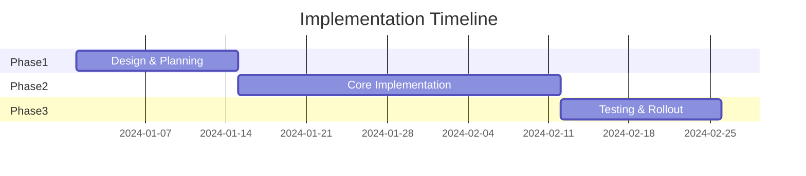

# Notes to Decision-Ready PPT

## Purpose

Transform technical notes into minimal, decision-oriented slides that drive action and alignment.

## When to Use

- Architecture review presentations
- Technical strategy presentations to leadership
- Quarterly or annual planning decks
- Design review sessions
- Proposal presentations for technical initiatives
- Cross-functional alignment meetings

## How to Use

### Input Requirements

Provide:
- Your technical notes or raw content
- Target audience (Engineering, Leadership, Cross-functional)
- Desired outcome (Approval, Alignment, Information)
- Time constraint (10-min, 30-min, 60-min presentation)

### Output Structure

Every decision deck follows this structure:

```
1. Title Slide - What we're deciding
2. Context - Why this matters now
3. Problem - What's not working
4. Options - Max 3 alternatives
5. Recommendation - Our choice
6. Impact - What this enables
7. Implementation - How we'll do it
8. Next Steps - What we need
```

## McKinsey Slide Principles

Each slide must have:

1. **Headline = Key Message** - The slide title IS the takeaway
2. **One clear point** - If you can't summarize in one sentence, split it
3. **Supporting evidence** - Data, examples, or logic that proves the headline
4. **Visual hierarchy** - Most important info is largest/boldest

## Slide Formats

### Title Slide

```
┌──────────────────────────────────┐
│                                  │
│    [Project/Initiative Name]     │
│                                  │
│    [Specific Decision Needed]    │
│                                  │
│    [Your Name]                   │
│    [Date]                        │
│                                  │
└──────────────────────────────────┘
```

### Context Slide

**Headline**: "Why This Matters Now"

```markdown
• Business driver (revenue, cost, compliance, etc.)
• Current limitations or risks
• Market opportunity or competitive pressure
• Strategic alignment with company goals
```

### Problem Slide

**Headline**: "[Specific Problem] Costs Us [Quantified Impact]"

```markdown
Current state:
• Symptom 1 → Business impact
• Symptom 2 → Business impact
• Symptom 3 → Business impact

Root cause: [One sentence]
```

### Options Slide

**Headline**: "Three Approaches to Consider"

```markdown
┌─────────────────────────────────────────────┐
│ Option A: [Name]                            │
│ Pros: [Key benefit]                         │
│ Cons: [Key drawback]                        │
│ Cost: $X | Timeline: X weeks                │
├─────────────────────────────────────────────┤
│ Option B: [Name]                            │
│ Pros: [Key benefit]                         │
│ Cons: [Key drawback]                        │
│ Cost: $X | Timeline: X weeks                │
├─────────────────────────────────────────────┤
│ Option C: [Name]                            │
│ Pros: [Key benefit]                         │
│ Cons: [Key drawback]                        │
│ Cost: $X | Timeline: X weeks                │
└─────────────────────────────────────────────┘
```

### Recommendation Slide

**Headline**: "Recommend [Option X] Because [Business Reason]"

```markdown
Why this option:
✓ [Decisive advantage 1]
✓ [Decisive advantage 2]
✓ [Decisive advantage 3]

Trade-offs we accept:
• [Minor limitation 1] - Mitigated by [solution]
• [Minor limitation 2] - Acceptable because [reason]
```

### Impact Slide

**Headline**: "[Recommendation] Delivers [Quantified Business Value]"

```markdown
Immediate impact (0-3 months):
• [Outcome with metric]

Medium-term impact (3-6 months):
• [Outcome with metric]

Long-term impact (6-12 months):
• [Outcome with metric]
```

### Implementation Slide

**Headline**: "[X]-Week Implementation in [Y] Phases"



Or as a simple table:

```markdown
| Phase | Timeline | Key Deliverable | Owner |
|-------|----------|-----------------|-------|
| 1. Design | Week 1-2 | Architecture doc | Team A |
| 2. Build | Week 3-6 | Core features | Team B |
| 3. Test | Week 7-8 | Production-ready | QA |
```

### Next Steps Slide

**Headline**: "Decision Needed: [Specific Approval] by [Date]"

```markdown
What we need:
1. [Specific approval/decision]
2. [Resource allocation]
3. [Budget approval]

What happens next:
• [Immediate next action]
• [Follow-up timeline]
• [Success metrics review date]

Questions?
```

## Example: Complete Deck

### Slide 1: Title
```
API Gateway Implementation

Decision: Approve $50K investment for Q2 implementation

John Smith, Principal Engineer
February 2, 2026
```

### Slide 2: Context
**"Current Architecture Can't Scale Beyond 10K Users"**

```
• User base growing 50% quarterly (5K → 15K by Q3)
• No rate limiting → service outages during traffic spikes
• No authentication layer → security audit findings
• Each new API endpoint requires 2 weeks of boilerplate
```

### Slide 3: Problem
**"Lack of API Gateway Costs $200K Annually in Engineering Time"**

```
Impact today:
• 40 hours/month on rate limiting per service
• 3 security vulnerabilities in last quarter
• 2 outages due to traffic spikes
• Feature velocity down 30%

Root cause: Missing centralized API management layer
```

### Slide 4: Options
**"Three Implementation Approaches Evaluated"**

```
┌───────────────────────────────────────────────┐
│ A: Build Custom                               │
│ ✓ Full control                                │
│ ✗ 6-month timeline, 2 engineers full-time     │
│ Cost: $200K | Timeline: 6 months              │
├───────────────────────────────────────────────┤
│ B: Use Kong (Open Source)                     │
│ ✓ Fast deployment, proven                     │
│ ✗ Limited support, ops overhead               │
│ Cost: $50K | Timeline: 6 weeks                │
├───────────────────────────────────────────────┤
│ C: Use AWS API Gateway                        │
│ ✓ Fully managed, zero ops                     │
│ ✗ Vendor lock-in, higher ongoing cost         │
│ Cost: $80K/year | Timeline: 4 weeks           │
└───────────────────────────────────────────────┘
```

### Slide 5: Recommendation
**"Recommend Kong Because It Balances Speed, Cost, and Control"**

```
Why Kong:
✓ 6-week timeline enables Q2 launch
✓ $50K one-time cost vs $80K/year for AWS
✓ No vendor lock-in, can migrate later
✓ Large community, proven at scale

Trade-offs we accept:
• Need 0.5 FTE for operations - Already in team capacity
• Less integrated than AWS - Worth it for cost savings
```

### Slide 6: Impact
**"Kong Gateway Enables 3x User Growth While Reducing Costs"**

```
Immediate (Weeks 1-8):
• Centralized rate limiting → No more traffic-spike outages
• Auth layer → Closes 3 security findings

Medium-term (Months 3-6):
• New API development 70% faster (2 weeks → 3 days)
• Engineering time savings: $120K/year

Long-term (Months 6-12):
• Supports 30K+ users with current infrastructure
• Foundation for API marketplace/partner integrations
```

### Slide 7: Implementation
**"8-Week Rollout in 3 Phases with Zero Downtime"**

```
| Phase | Duration | Milestone | Risk |
|-------|----------|-----------|------|
| Setup | Week 1-2 | Kong deployed, staging tested | Low |
| Migration | Week 3-6 | APIs migrated incrementally | Medium |
| Cutover | Week 7-8 | Full production traffic | Low |

Risk mitigation:
• Parallel run for 2 weeks before cutover
• Rollback plan tested in staging
• 24/7 on-call during migration weeks
```

### Slide 8: Next Steps
**"Decision Needed: Approve $50K by Feb 15 for Q2 Delivery"**

```
What we need:
1. Budget approval: $50K infrastructure investment
2. Resource allocation: 1.5 engineers for 8 weeks
3. Production access: Kong deployment approval

What happens next:
• Feb 16: Procurement and setup (Week 1-2)
• Mar 1: Begin API migration (Week 3-6)
• Mar 29: Production cutover (Week 7-8)
• Apr 5: Retrospective and optimization

Questions?
```

## Visual Design Principles

### Slide Layout

```
┌────────────────────────────────────┐
│ Headline: The Key Takeaway         │  ← Bold, 24-28pt
├────────────────────────────────────┤
│                                    │
│ • Supporting point 1               │  ← 18-20pt
│ • Supporting point 2               │
│ • Supporting point 3               │
│                                    │
│ [Visual: Chart, diagram, table]    │  ← Use visuals
│                                    │
│                                    │
└────────────────────────────────────┘
    Page number in footer
```

### Use Visual Hierarchy

1. **Headline**: Largest, bold - The conclusion
2. **Body**: Medium - The supporting evidence
3. **Footnotes**: Smallest - Additional context

### Limit Text

- **Max 6 lines** of body text per slide
- **Max 6 words** per bullet point (ideal)
- **One chart/visual** per slide maximum

### Use Signal Words

- ✓ Use checkmarks for positive points
- ✗ Use X marks for negative points
- → Use arrows for progression/cause-effect
- • Use bullets for lists

## Audience Adjustments

### For Technical Audience (Engineers)
- Can include architecture diagrams
- Brief technical details acceptable
- Focus on engineering efficiency gains

### For Executive Audience (VPs, C-level)
- Remove technical jargon
- Lead with business impact
- Focus on ROI and strategic value
- Include risk mitigation

### For Cross-Functional (Product, Ops, Business)
- Balance technical and business language
- Show impact to each function
- Use analogies for technical concepts

## Common Mistakes to Avoid

1. **Text-heavy slides**: If you're reading the slide, it's too much text
2. **Burying the lead**: Headline should be the conclusion, not a topic
3. **Too many options**: Max 3, ideally 2
4. **Missing the ask**: Always end with specific decision needed
5. **Vague impact**: "Improves performance" → "Reduces latency 70%"
6. **No timeline**: Always include dates and durations
7. **Lack of visuals**: Use charts, diagrams, tables

## Presentation Tips

### Before the Meeting
- Send deck 24 hours in advance
- Include appendix with technical details
- Prepare for common questions

### During the Meeting
- Start with the decision/ask
- Allow questions on each slide
- Don't read slides verbatim
- Focus on discussion, not presentation

### After the Meeting
- Send summary of decisions made
- Track action items with owners
- Follow up on timeline commitments

## Resources

### Presentation Design
- [McKinsey Slide Structure](https://www.slideshare.net/YanivG/mckinsey-presentation)
- [Pyramid Principle for Presentations](https://speakingsherpa.com/pyramid-principle-presentations/)

### Visual Communication
- [Storytelling with Data](https://www.storytellingwithdata.com/)
- [Presentation Zen](https://www.presentationzen.com/)

## Quick Checklist

- [ ] Max 8 slides (excluding appendix)
- [ ] Each slide has clear headline = key message
- [ ] One point per slide
- [ ] All impacts quantified with metrics
- [ ] Max 3 options presented
- [ ] Clear recommendation with business justification
- [ ] Specific decision/ask stated
- [ ] Timeline with dates/durations
- [ ] Risks identified with mitigation
- [ ] Visual hierarchy clear
- [ ] Text minimal (max 6 lines body text)
- [ ] Proofread for clarity and typos
