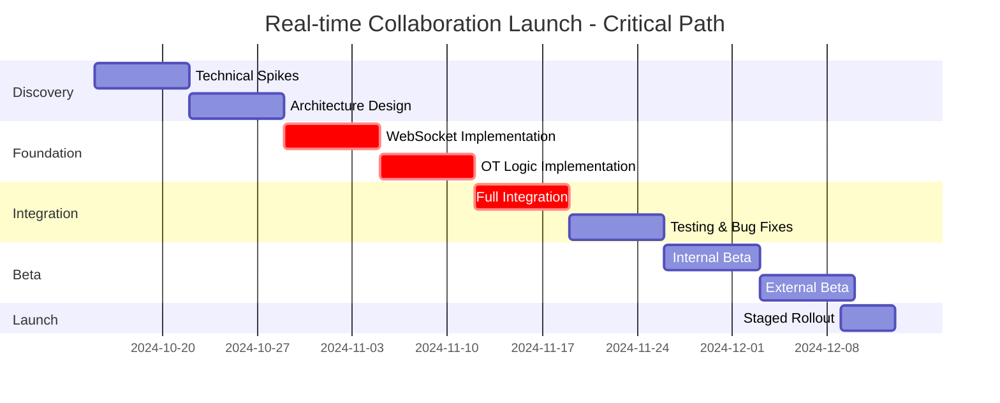

# Time-Sensitive Work to Prioritized Execution Plan

## Purpose

Convert goals and constraints into dependency-aware execution plans that optimize for delivery.

## When to Use

- Tight deadline situations
- Incident resolution and recovery
- Multi-workstream coordination
- Resource-constrained projects
- Quarter or sprint planning
- Product launch preparations

## Execution Planning Framework

### Inputs Needed

```markdown
**Goals**:
- What needs to be delivered?
- What's the success criteria?
- What's negotiable vs fixed?

**Constraints**:
- Timeline (hard deadline? flexible?)
- Resources (team size, skills, availability)
- Dependencies (external teams, services, approvals)
- Budget (infrastructure, tools, services)
- Quality bars (testing requirements, SLAs)

**Risks**:
- What could go wrong?
- What are the unknowns?
- What's the biggest bottleneck?
```

### Planning Principles

1. **Critical Path First**: Focus on what blocks everything else
2. **Parallelization**: What can happen simultaneously?
3. **Risk Front-Loading**: Tackle unknowns early
4. **Flexible Scope**: Identify must-have vs nice-to-have
5. **Buffer Time**: Always include contingency

## Example: Q4 Feature Launch

### Input: Goals and Constraints

```markdown
## Goals
- Launch "Real-time Collaboration" feature by Dec 15 (board commitment)
- Support 100 concurrent users per document
- 99.9% uptime SLA
- Mobile web support (iOS Safari, Android Chrome)

## Constraints
- Timeline: 10 weeks (Oct 15 - Dec 15)
  - Week of Dec 1-8: Holiday freeze, no deployments
  - Effective delivery: Dec 12 (3 days before deadline)
- Team: 2 senior backend, 2 mid-level frontend, 1 QA
- Budget: $5K infrastructure (approved)
- External: Need security review (2-week turnaround)

## Known Risks
- WebSocket technology new to team
- Operational transform library choice unclear
- Load testing infrastructure doesn't exist
- Marketing wants beta testers in week 8
```

### Output: Execution Plan

#### Phase 1: Discovery & Derisking (Week 1-2)

**Goal**: Reduce technical unknowns before committing to approach

```markdown
**Week 1: Technical Spikes**

Parallel workstreams:

Stream A (Backend Senior #1):
- Day 1-3: Evaluate OT libraries (ShareDB vs Yjs vs custom)
- Day 4-5: POC - sync text between 2 browsers
- Deliverable: Library recommendation with rationale

Stream B (Backend Senior #2):
- Day 1-2: Design WebSocket architecture (scaling, failover)
- Day 3-5: POC - WebSocket server with Redis pub/sub
- Deliverable: Architecture diagram and capacity estimates

Stream C (Frontend Mid #1):
- Day 1-5: Research cursor sharing UX patterns
- Deliverable: UI/UX mockups for presence indicators

Risk mitigation:
- If POCs fail by end of week 1, escalate immediately
- Go/no-go decision: End of week 2

**Week 2: Architecture & Planning**

- Day 1: Team sync - review POC results
- Day 2-3: Finalize architecture (all hands)
- Day 4: Break down into tasks
- Day 5: Sprint planning, commit to timeline

Circuit breaker:
- If architecture not solid by end of week 2, add 2 weeks to timeline
- Communicate to stakeholders immediately
```

#### Phase 2: Foundation (Week 3-4)

**Goal**: Build core infrastructure

```markdown
**Critical Path** (blocks everything):

Backend Senior #1:
- Week 3: Implement WebSocket server with Redis
- Week 4: Implement operational transform logic
- Deliverable: Can sync text edits between 2 clients

Backend Senior #2:
- Week 3: Database schema, API endpoints
- Week 4: Presence system (active users tracking)
- Deliverable: Users can see who's online

**Parallel Work**:

Frontend Mid #1:
- Week 3: Editor integration setup
- Week 4: WebSocket client connection
- Deliverable: Editor connects to backend

Frontend Mid #2:
- Week 3: UI for presence indicators
- Week 4: Cursor position display
- Deliverable: See others' cursors

QA:
- Week 3: Test plan creation
- Week 4: Test environment setup
- Deliverable: Ready to start testing in week 5

Risk Watch:
- If WebSocket implementation takes > 1 week, cut cursor display (nice-to-have)
- Daily standups to catch blockers early
```

#### Phase 3: Core Features (Week 5-6)

**Goal**: Feature complete for MVP

```markdown
**Week 5: Integration**

Backend:
- Integrate all components
- Error handling and edge cases
- Basic load testing (10 users)

Frontend:
- Full editor integration
- Presence UI polish
- Error state handling

QA:
- Begin integration testing
- Identify critical bugs

**Week 6: Refinement**

Backend:
- Performance optimization
- Connection stability improvements
- Load testing (50 users)

Frontend:
- UX improvements based on QA feedback
- Accessibility pass
- Mobile web testing

QA:
- Full test coverage
- Bug bash session (whole team)

Milestone:
- End of week 6: Feature complete for internal testing
- Go/no-go: If > 5 P1 bugs, delay beta to week 9
```

#### Phase 4: Beta & Security (Week 7-8)

**Goal**: Beta testing and security review

```markdown
**Week 7: Internal Beta**

- Day 1: Deploy to staging
- Day 2-3: Internal team testing (20 people)
- Day 4-5: Fix critical bugs
- Friday: Decision - ready for external beta?

External Beta (if ready):
- 50 beta customers invited
- Feedback survey sent
- On-call rotation (monitor issues)

Security Review:
- Submit to security team (2-week turnaround)
- Continue development while waiting

**Week 8: Beta Continued + Marketing Prep**

Beta:
- Monitor usage, collect feedback
- Fix bugs (prioritize P0/P1)
- Prepare for wider rollout

Marketing:
- Beta testers give testimonials
- Marketing team sees product demos
- Draft blog post

Risk mitigation:
- If security review finds issues, week 9 becomes fix week
- Buffer: Week 9 available for major issues
```

#### Phase 5: Rollout (Week 9-10)

**Goal**: Gradual rollout to all users

```markdown
**Week 9: Staged Rollout**

Monday (10%):
- Enable for 10% of paid teams
- Monitor metrics: error rate, latency, usage
- On-call ready for incidents

Wednesday (25%):
- If metrics healthy, enable for 25%
- Continue monitoring

Friday (50%):
- If metrics healthy, enable for 50%
- Weekend on-call coverage

**Week 10: Full Launch**

Monday (100%):
- Enable for all users
- Monitor closely

Wednesday:
- Blog post published
- In-app announcement
- Email to all users

Friday:
- Retrospective
- Celebrate launch!

Rollback Plan:
- Feature flag for instant disable
- Can rollback to week-old version in 30 minutes
- Communication template for users if rollback needed
```

#### Week 11: Holiday Freeze (Dec 1-8)

```markdown
NO CHANGES during this week

- Monitoring only
- On-call rotation
- Fix only P0 production issues
- No feature work
```

#### Week 12: Post-Launch (Dec 9-12)

```markdown
Goal: Polish and close gaps

Monday-Tuesday:
- Address feedback from weekend usage
- Fix any minor bugs

Wednesday (Dec 12):
- Final deployment window
- Last chance for fixes before deadline

Thursday-Friday (Buffer):
- Reserved for emergency fixes only
- Ideally: no changes, monitoring only

Dec 15: Official Launch Date (no work needed, already live)
```

### Resource Allocation

```markdown
## Team Capacity

**Backend Senior #1** (10 weeks):
- Week 1-2: Technical spikes (discovery)
- Week 3-4: WebSocket + OT implementation
- Week 5-6: Integration and optimization
- Week 7-8: Beta support, security review fixes
- Week 9-10: Rollout support
- Total: 100% allocated

**Backend Senior #2** (10 weeks):
- Week 1-2: Architecture design
- Week 3-4: Presence system
- Week 5-6: Performance optimization
- Week 7-8: Load testing, monitoring
- Week 9-10: Rollout support
- Total: 100% allocated

**Frontend Mid #1** (10 weeks):
- Week 1-2: UX research (50%), other work (50%)
- Week 3-6: Editor integration (100%)
- Week 7-8: Beta testing support (100%)
- Week 9-10: Bug fixes, polish (100%)
- Total: 90% allocated

**Frontend Mid #2** (10 weeks):
- Week 1-2: Other work (100%)
- Week 3-6: UI implementation (100%)
- Week 7-8: Mobile testing (100%)
- Week 9-10: Bug fixes (50%), other work (50%)
- Total: 70% allocated

**QA** (10 weeks):
- Week 1-2: Other work (100%)
- Week 3-4: Test planning (50%), other work (50%)
- Week 5-10: Testing and validation (100%)
- Total: 70% allocated

Total team-weeks: 43 weeks
Planned work: 43 weeks
Buffer: Built into individual task estimates
```

### Critical Path



### Risk Register

```markdown
## High Risks (Could derail project)

**Risk 1: OT library doesn't meet needs**
- Impact: High (core functionality)
- Likelihood: Medium
- Mitigation: Evaluate in week 1, have fallback options
- Owner: Backend Senior #1
- Status: ⚠️ Monitor

**Risk 2: Security review finds critical issues**
- Impact: High (can't launch)
- Likelihood: Low
- Mitigation: Submit early (week 7), have buffer week (week 9)
- Owner: Backend Senior #2
- Status: ⚠️ Monitor

**Risk 3: Performance doesn't meet 100 concurrent users target**
- Impact: High (violates requirements)
- Likelihood: Medium
- Mitigation: Load test early (week 5-6), optimize architecture
- Owner: Backend Senior #2
- Status: ⚠️ Monitor

## Medium Risks (Could impact timeline)

**Risk 4: Team unfamiliar with WebSocket technology**
- Impact: Medium (slower development)
- Likelihood: High
- Mitigation: Spikes in week 1-2, pair programming
- Owner: Both backend seniors
- Status: ✅ Mitigated

**Risk 5: Mobile web browser compatibility issues**
- Impact: Medium (delay mobile support)
- Likelihood: Medium
- Mitigation: Test early (week 6), mobile web is MVP not blocker
- Owner: Frontend Mid #2
- Status: ⚠️ Monitor

## Low Risks (Minor impact)

**Risk 6: Beta user feedback requires UX changes**
- Impact: Low (can address post-launch)
- Likelihood: High
- Mitigation: Accept feedback, prioritize for phase 2
- Owner: Product Manager
- Status: ✅ Accepted
```

### Success Metrics

```markdown
## Launch Criteria (Must meet to launch)

- [ ] Core collaboration works (text sync between 2+ users)
- [ ] Presence indicators show active users
- [ ] P0/P1 bugs: 0
- [ ] P2 bugs: < 5
- [ ] Security review: Passed
- [ ] Load test: Supports 100 concurrent users
- [ ] Uptime in beta: > 99.5%
- [ ] Mobile web: Works on iOS Safari, Android Chrome

## Success Metrics (Post-launch)

**Adoption** (3 months):
- 30% of paid teams use collaboration feature weekly
- Average session: 3+ users per document

**Performance** (ongoing):
- P95 latency: < 500ms
- Uptime: > 99.9%
- Error rate: < 1%

**Business** (6 months):
- Contribute to 2 enterprise deal wins
- Customer satisfaction: > 80% positive feedback
```

### Scope Flexibility

```markdown
## Must Have (MVP)

✅ **Non-negotiable**:
- Real-time text synchronization
- See who's currently editing (user list)
- Conflict-free merge (operational transform)
- Works on desktop web

## Should Have (Target for launch)

⚠️ **Flexible** (can drop if needed):
- Cursor position display (nice visual, not critical)
- Mobile web support (can launch desktop-only)
- Presence timeout indicators (away status)

## Won't Have (Post-launch)

❌ **Explicitly out of scope**:
- Commenting and suggestions
- Change tracking/history
- Video/audio chat
- Offline editing with sync
- Mobile app support (native)
```

## Execution Planning Templates

### Daily Standup Format

```markdown
For each person:
- Yesterday: What shipped?
- Today: What's the focus?
- Blockers: What's in the way?
- Risk: Any concerns about the timeline?
```

### Weekly Check-in Format

```markdown
## Week X Status

### Completed
- [Task] by [Person]
- [Task] by [Person]

### In Progress
- [Task] by [Person] - [% complete]

### Blocked
- [Task] by [Person] - Blocked by [blocker]

### Risks
- [Risk description] - [Mitigation plan]

### Next Week Plan
- [Key focus area 1]
- [Key focus area 2]

### Asks/Escalations
- [What do we need from stakeholders?]
```

## Resources

### Project Management
- [Critical Path Method](https://en.wikipedia.org/wiki/Critical_path_method)
- [Eisenhower Matrix](https://www.eisenhower.me/eisenhower-matrix/) - Prioritization
- [RACI Matrix](https://www.projectmanager.com/raci-chart) - Responsibility assignment

### Risk Management
- [Risk Register Template](https://www.projectmanager.com/templates/risk-register-template)
- [Pre-Mortem Technique](https://hbr.org/2007/09/performing-a-project-premortem)

### Agile Planning
- [SAFe Program Increment Planning](https://www.scaledagileframework.com/pi-planning/)
- [Shape Up by Basecamp](https://basecamp.com/shapeup)

## Quick Checklist

- [ ] Goals clearly defined with success criteria
- [ ] Constraints documented (time, resources, budget)
- [ ] Critical path identified
- [ ] Parallel workstreams maximized
- [ ] Risks identified with mitigation plans
- [ ] Resource allocation balanced (no single person over-allocated)
- [ ] Buffer time included (10-20%)
- [ ] Scope flexibility defined (must/should/won't have)
- [ ] Circuit breakers defined (go/no-go decision points)
- [ ] Dependencies on external teams tracked
- [ ] Daily/weekly check-in cadence established
- [ ] Rollback plan documented
