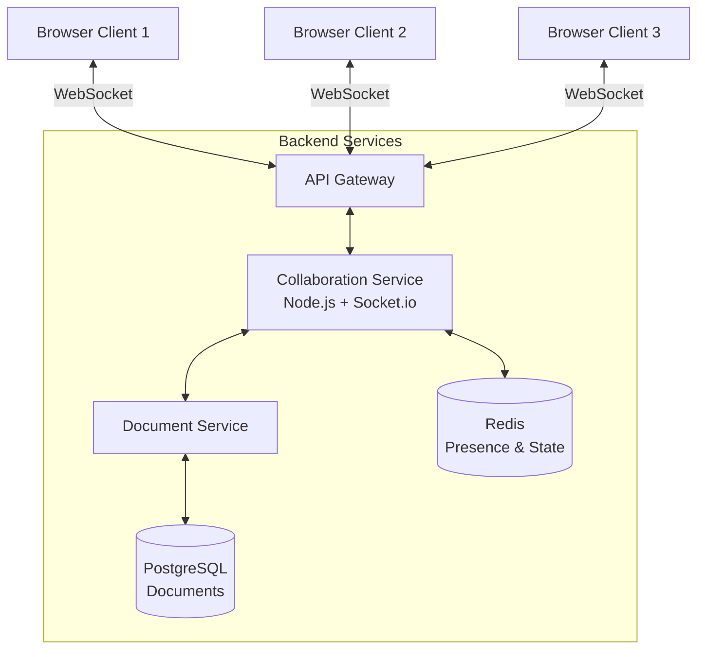
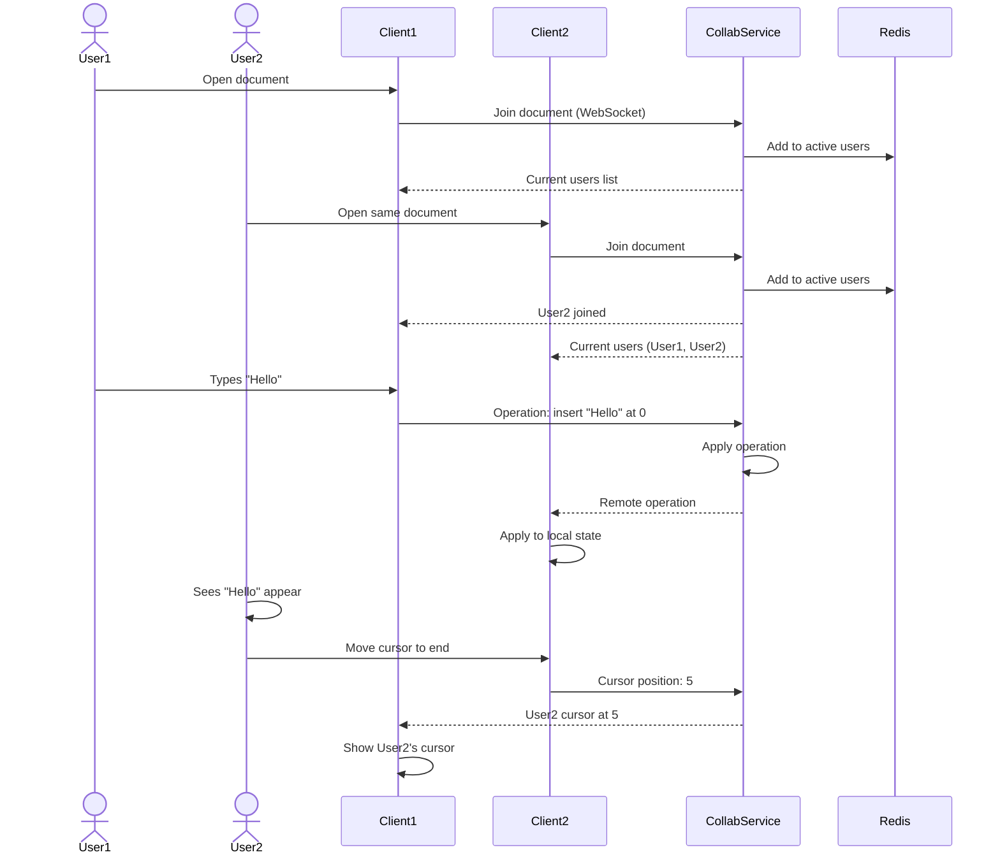

# Feature Idea to End-to-End Solution Shape

## Purpose

Expand feature ideas into comprehensive solution outlines before committing to implementation.

## When to Use

- Feature scoping and planning sessions
- Tech lead taking ownership of new features
- Pre-planning refinement (before sprint)
- Architectural spike investigations
- Product-engineering alignment meetings
- Budget and resource planning

## Solution Shape Components

A complete feature shape includes:

1. **Scope** - What's in, what's out
2. **Architecture** - High-level technical approach
3. **User Flow** - Key interactions
4. **Data Model** - Core entities and relationships
5. **Dependencies** - What we rely on
6. **Risks** - Technical and product risks
7. **Rollout Plan** - Phased delivery approach
8. **Success Metrics** - How we measure success

## The Shape Up Methodology

Based on Basecamp's Shape Up process:

### Appetite vs Estimate

- **Appetite**: Time we're willing to spend (2 weeks, 6 weeks)
- **Estimate**: Time we think it'll take
- Shape to fit appetite, not estimate to scope

### Problem-First Approach

Start with the problem, not the solution:

❌ "We should add a recommendation engine"
✅ "Users abandon cart because they can't discover related products"

## Example: Real-Time Collaboration

### Input: Feature Idea

```
Product Manager's idea:
"Add real-time collaboration to our document editor, like Google Docs. 
Users want to edit documents together and see each other's changes instantly."
```

### Output: Shaped Solution

```markdown
# Feature Shape: Real-Time Document Collaboration

**Owner**: @engineering-team-lead
**Product Lead**: @product-manager
**Appetite**: 6 weeks
**Target**: Q2 2026 release

## Problem Statement

**Current state**:
Users email documents back and forth, leading to version confusion and
merge conflicts. 80% of enterprise customers requested collaboration features.

**Impact**:
- 30% of support tickets related to version conflicts
- Lost 3 enterprise deals to Google Workspace (competitive gap)
- Users create duplicate documents to avoid conflicts

**Success looks like**:
Multiple users can edit same document simultaneously with real-time updates
and conflict-free merge.

## Scope

### Must Have (Core Value)
✅ **Multiple users can edit simultaneously**
✅ **See others' cursors and selections** (presence)
✅ **Changes appear in real-time** (< 500ms latency)
✅ **Automatic conflict resolution** (operational transform)
✅ **See who's currently editing** (active users list)

### Should Have (Important but not MVP)
⚠️ **Commenting and suggestions** (defer to phase 2)
⚠️ **Version history with restore** (use existing system)
⚠️ **Document-level permissions** (inherit from existing)

### Won't Have (Out of Scope)
❌ **Video/audio chat** (use existing meeting tools)
❌ **Real-time co-editing in mobile app** (web only for MVP)
❌ **Offline editing with sync** (requires different architecture)
❌ **Presence indicators in document list** (only within document)

### Appetite
**6-week cycle**:
- Week 1-2: Core infrastructure (WebSocket, OT)
- Week 3-4: UI presence indicators and cursor sync
- Week 5: Polish and edge cases
- Week 6: Testing and bug fixes

## Architecture Outline

### High-Level Design



### Technology Choices

**Real-time layer**:
- **WebSocket** (Socket.io) for bidirectional communication
- **Operational Transform** (ShareDB or Yjs) for conflict resolution
- **Redis** for presence and ephemeral state

**Why these choices**:
- WebSocket: Industry standard, we have infrastructure
- Socket.io: Handles reconnection, fallback to polling
- ShareDB: Battle-tested, JSON operation transform
- Redis: Fast pub/sub, existing infrastructure

**Alternatives considered**:
- CRDTs (Yjs): More complex, overkill for MVP
- Firebase: Vendor lock-in, cost concerns at scale
- Custom OT: Too risky, reinventing wheel

### Key Components

1. **Collaboration Service** (new)
   - Manages WebSocket connections
   - Applies and broadcasts operations
   - Tracks active users per document
   - Handles client reconnection

2. **Frontend Editor Integration** (modify existing)
   - Send local changes as operations
   - Apply remote operations to local state
   - Show cursor positions and selections
   - Display active user avatars

3. **Presence System** (new)
   - Track users in each document
   - Broadcast join/leave events
   - Heartbeat mechanism (detect disconnects)
   - Cursor position sync

## User Flow

### Happy Path: Two Users Collaborate



### Edge Cases

```markdown
Reconnection:
- User loses network → Client attempts reconnect
- Client sends last operation ID
- Server sends missed operations
- User's cursor shown as "reconnecting"

Conflict resolution:
- Both users type at same position
- Operational transform resolves automatically
- Both changes preserved (e.g., "HWelorld" becomes "HelloWorld")

Large documents:
- Only load visible portion initially
- Stream document in chunks
- Apply operations to full document state (server-side)
```

## Data Model

### Core Entities

```typescript
// Document (existing, extend)
interface Document {
  id: string;
  title: string;
  content: YjsDocument;  // NEW: Yjs document state
  version: number;       // NEW: OT version
  // ... existing fields
}

// Active Session (new)
interface CollabSession {
  documentId: string;
  userId: string;
  connectionId: string;
  cursorPosition: number;
  selection: { start: number; end: number };
  lastSeen: timestamp;
}

// Operation (new)
interface Operation {
  documentId: string;
  version: number;
  userId: string;
  type: 'insert' | 'delete' | 'format';
  position: number;
  content?: string;
  timestamp: timestamp;
}
```

### Storage Strategy

```markdown
**Hot state (Redis)**:
- Active sessions (TTL: 5 minutes)
- Recent operations (TTL: 1 hour)
- Cursor positions (TTL: 1 minute)

**Persistent state (PostgreSQL)**:
- Document content (every 30 seconds)
- Operation log (for 30 days, then archive)
- Document versions (snapshots every 100 operations)

**Why Redis**:
- Sub-millisecond read/write
- Built-in TTL for ephemeral data
- Pub/sub for broadcasting
```

## Dependencies

### Internal Dependencies

```markdown
**Document Service** (existing):
- Need: API to save document snapshots
- Risk: May need refactor to support versioning
- Owner: @docs-team

**Auth Service** (existing):
- Need: Real-time JWT validation
- Risk: Current implementation too slow (200ms)
- Mitigation: Cache tokens in Redis

**Frontend Editor** (existing):
- Need: Refactor to use operation-based model
- Risk: Tightly coupled to direct manipulation
- Mitigation: Abstract behind interface
```

### External Dependencies

```markdown
**Socket.io** (library):
- Version: 4.5+
- Risk: Breaking changes in 5.0
- Mitigation: Pin version, test upgrade path

**ShareDB or Yjs** (library):
- Decision needed: Which OT library?
- Evaluation: Spike in week 1
- Fallback: Build minimal OT (risky)

**Redis** (infrastructure):
- Need: Dedicated instance (high throughput)
- Cost: ~$200/month
- Approval: Needed from infra team
```

## Risks & Mitigation

### Technical Risks

**Risk 1: Operational Transform complexity**
- **Impact**: High (core feature)
- **Likelihood**: Medium
- **Mitigation**: 
  - Use battle-tested library (ShareDB/Yjs)
  - Spike in week 1 to de-risk
  - Fallback: Simple last-write-wins (graceful degradation)

**Risk 2: Scale to 100 concurrent users per document**
- **Impact**: Medium (most docs have < 10)
- **Likelihood**: Low
- **Mitigation**:
  - Load test early (week 3)
  - Implement rate limiting
  - Document hard limit (50 users)

**Risk 3: WebSocket connection stability**
- **Impact**: High (UX degradation)
- **Likelihood**: Medium (mobile networks flaky)
- **Mitigation**:
  - Auto-reconnect with exponential backoff
  - Queue operations locally during disconnect
  - Clear UX indicators ("Reconnecting...")

### Product Risks

**Risk 1: Users confused by cursor ghosts**
- **Impact**: Medium (support tickets)
- **Likelihood**: Medium
- **Mitigation**:
  - Clear visual design (different colors per user)
  - Tooltips showing user name
  - Dismiss stale cursors (> 10s inactive)

**Risk 2: Not valuable for single-user documents**
- **Impact**: Low (most users solo edit)
- **Likelihood**: High
- **Mitigation**:
  - Don't degrade single-user experience
  - Collaboration features optional/passive
  - Focus rollout on teams, not individuals

## Rollout Plan

### Phase 1: Internal Alpha (Week 5)
- **Audience**: Engineering team (20 people)
- **Goal**: Catch major bugs, test reconnection
- **Success**: Can collaborate on team docs without crashes
- **Duration**: 3 days

### Phase 2: Beta (Week 6)
- **Audience**: Enterprise beta customers (5 companies, 50 users)
- **Goal**: Validate value, collect feedback
- **Feature flag**: `collaboration_beta`
- **Success**: > 70% say it's useful, < 5 P1 bugs
- **Duration**: 1 week

### Phase 3: Gradual Rollout (Week 7-8)
- **Week 7**: 10% of paid teams
- **Week 8**: 50% of paid teams
- **Monitoring**: Error rates, latency, concurrent users
- **Rollback**: Disable via feature flag if issues

### Phase 4: General Availability (Week 9)
- **Audience**: All users
- **Marketing**: Blog post, in-app announcement
- **Docs**: Help articles, video tutorial

### Feature Flags

```markdown
collaboration_enabled (default: true):
  - Master kill switch
  - Disable if infrastructure issues

collaboration_presence (default: true):
  - Show cursors and active users
  - Disable if performance issues

collaboration_max_users (default: 50):
  - Configurable limit per document
  - Prevent scale issues
```

## Success Metrics

### Leading Indicators (Week 1-2)
- Collaboration sessions initiated
- Average number of users per session
- Time spent in collaborative sessions
- WebSocket connection stability (% uptime)

### Lagging Indicators (Month 1-3)
- % of documents with > 1 editor
- Reduction in version conflict support tickets (target: -50%)
- Customer satisfaction (NPS) in enterprise segment
- Competitive win rate (vs Google Workspace)

### Technical Metrics
- P95 latency of operations (target: < 500ms)
- WebSocket error rate (target: < 1%)
- Redis memory usage (monitor, alert if > 80%)
- Operations per second per document (capacity planning)

### Success Criteria (3 months post-launch)
✅ **Adoption**: 30% of paid teams use collaboration weekly
✅ **Performance**: P95 latency < 500ms, uptime > 99.9%
✅ **Value**: 50% reduction in version conflict tickets
✅ **Business**: Contribute to closing 2 enterprise deals

## Open Questions

- [ ] **Max users per document**: 50 or 100? (Need load testing)
- [ ] **Mobile app support**: Include in scope or defer? (Check with product)
- [ ] **ShareDB vs Yjs**: Which library? (Spike in week 1)
- [ ] **Presence timeout**: How long before user shown as "away"? (UX decision)
- [ ] **Redis sizing**: Single instance or cluster? (Depends on load test)

## Next Steps

1. **Week before kickoff**:
   - [ ] Product approval on scope
   - [ ] Infrastructure approval ($200/month Redis)
   - [ ] Assign team (2 backend, 2 frontend, 1 QA)
   - [ ] Schedule kick-off meeting

2. **Week 1 (Spike)**:
   - [ ] Evaluate ShareDB vs Yjs (2 days)
   - [ ] Proof-of-concept: Sync text between 2 browsers (3 days)
   - [ ] Go/no-go decision (end of week)

3. **Week 2-6 (Implementation)**:
   - [ ] Follow 6-week cycle plan
   - [ ] Weekly demos to stakeholders
   - [ ] Daily standups on blockers

4. **Week 7+ (Launch)**:
   - [ ] Follow rollout plan
   - [ ] Monitor metrics
   - [ ] Collect feedback for phase 2
```

## Shaping Best Practices

### 1. Fix Time, Flex Scope

❌ **Estimate-driven**: "This will take 10 weeks"
✅ **Appetite-driven**: "We have 6 weeks, what can we do?"

### 2. Work at Right Level of Abstraction

❌ **Too abstract**: "Add collaboration" (unclear scope)
❌ **Too concrete**: "Use ShareDB version 2.1.3 with Redis Sentinel" (prescriptive)
✅ **Just right**: "Real-time sync using OT library, Redis for state"

### 3. Identify Rabbitholes Early

```markdown
Potential rabbitholes:
⚠️ Perfect conflict UX → Accept OT will sometimes be weird
⚠️ Mobile app support → Web only for MVP
⚠️ Offline editing → Requires CRDT, out of scope
⚠️ Undo/redo with collaboration → Hard problem, use simple stack
```

### 4. Include Circuit Breakers

What if mid-project we realize it won't work:

```markdown
Circuit breaker #1 (End of Week 1):
- Can we sync text between 2 browsers reliably?
- If no → Stop, reassess approach

Circuit breaker #2 (End of Week 3):
- Can we handle 10 users without performance issues?
- If no → Reduce scope or extend timeline

Circuit breaker #3 (Beta phase):
- Do users find it valuable (> 70% positive)?
- If no → Pause rollout, gather more feedback
```

## Resources

### Methodology
- [Shape Up](https://basecamp.com/shapeup) - Basecamp's product development process
- [RFC Template](https://blog.pragmaticengineer.com/rfcs-and-design-docs/)

### Real-Time Collaboration
- [Operational Transform](https://operational-transformation.github.io/)
- [CRDTs](https://crdt.tech/)
- [Yjs](https://docs.yjs.dev/) - CRDT library
- [ShareDB](https://share.github.io/sharedb/) - OT library

## Quick Checklist

- [ ] Problem clearly stated (not just solution)
- [ ] Scope defined (must/should/won't have)
- [ ] Appetite set (time-boxed)
- [ ] Architecture outlined (high-level)
- [ ] Key user flows described
- [ ] Data model sketched
- [ ] Dependencies identified
- [ ] Risks assessed with mitigation
- [ ] Phased rollout plan
- [ ] Success metrics defined
- [ ] Open questions listed
- [ ] Rabbitholes identified
- [ ] Circuit breakers defined
- [ ] Next steps clear
