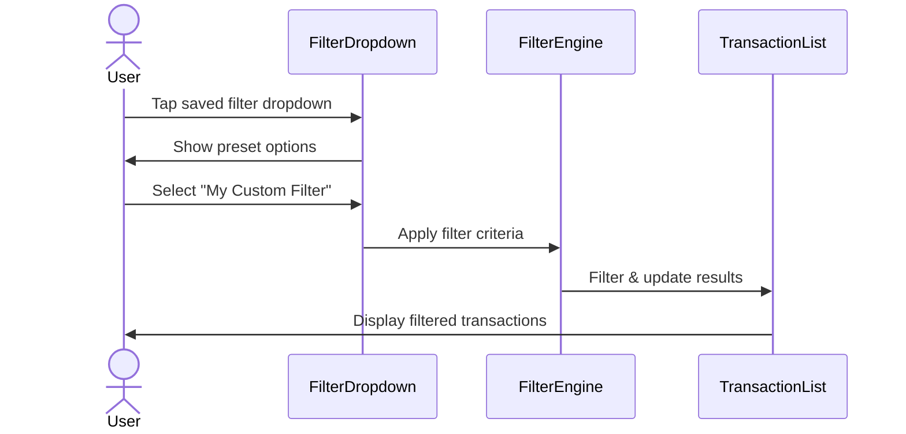

# Intent to UI Representation

## Purpose

Accelerate UI ideation by converting user flows and constraints into visual layouts without manual design work.

## When to Use

- Early feature exploration and concept validation
- Stakeholder alignment on user flows
- Rapid prototyping sessions
- Mobile-first or responsive design planning
- Design system integration planning

## How to Use

### Step 1: Gather Requirements

Collect the following information:

**User Intent**: What the user needs to accomplish
- Primary user action/goal
- User journey or flow
- Key interactions

**Constraints**:
- Platform (mobile-first, desktop, responsive)
- Design system or framework (Material Design, Apple HIG, custom)
- Performance constraints (max taps, page load)
- Accessibility requirements

**Data Elements**:
- What information needs to be displayed
- Input fields required
- Actions available to user

### Step 2: Generate Wireframe

Create a text-based wireframe or use Mermaid diagrams for flow visualization:

```
Example Request:

Transform this user intent into a UI wireframe:

Intent: Users need to quickly filter 1000+ transaction records by date range,
amount, and category, with ability to save filter presets.

Constraints:
- Mobile-first design
- Must work with existing Material Design system
- Max 2 taps to apply saved filter
```

### Step 3: Output Format

Provide wireframes in multiple formats:

1. **Text-based layout** (ASCII art or structured description)
2. **Component breakdown** (list of UI components needed)
3. **User flow diagram** (Mermaid sequence diagram)
4. **Interaction notes** (tap/click behaviors)

## Expected Output

### Text-Based Wireframe Example

```
┌─────────────────────────────────┐
│  ← Transactions        [Filter] │
├─────────────────────────────────┤
│                                 │
│  [Saved Filters ▼]              │
│  ┌─────────────────────────┐   │
│  │ All Transactions        │   │
│  │ Last 30 Days           │   │
│  │ ★ My Custom Filter     │   │
│  └─────────────────────────┘   │
│                                 │
│  Quick Filters:                 │
│  [This Week] [This Month]       │
│                                 │
│  Transaction List:              │
│  ┌─────────────────────────┐   │
│  │ Coffee Shop    -$4.50   │   │
│  │ 09:30 AM • Food         │   │
│  ├─────────────────────────┤   │
│  │ Grocery Store  -$87.23  │   │
│  │ Yesterday • Shopping    │   │
│  └─────────────────────────┘   │
└─────────────────────────────────┘
```

### Component Breakdown

```markdown
Components needed:
1. Header with back button and filter icon
2. Dropdown for saved filter presets (max 2 taps requirement)
3. Quick filter chips for common date ranges
4. Scrollable transaction list with:
   - Transaction name
   - Amount (color-coded: red for debit, green for credit)
   - Timestamp and category
5. Floating action button for creating new filter preset
```

### User Flow Diagram



## Design System Considerations

### Material Design

- Use Material chips for quick filters
- Bottom sheet for detailed filter options
- FAB for save/create actions
- Cards for transaction items

### Apple HIG

- Use segmented control for quick filters
- Modal sheet for filter details
- System SF Symbols for icons
- List with disclosure indicators

### Custom Design System

- Verify component availability in design system
- Note any new components needed
- Ensure consistent spacing/typography
- Check color palette compatibility

## Interaction Details

Document key interactions:

```markdown
Interactions:
1. Tap "Filter" icon → Opens filter sheet
2. Tap saved filter dropdown → Expands preset list (iOS: action sheet)
3. Select preset → Immediately applies filter + closes dropdown
4. Tap quick filter chip → Toggles filter on/off
5. Long-press preset → Shows edit/delete options
6. Tap transaction → Navigates to transaction detail
```

## Mobile-First Best Practices

- **Thumb-friendly zones**: Primary actions in bottom 60% of screen
- **One-handed operation**: Key actions reachable with thumb
- **Visible feedback**: Loading states, transitions, confirmations
- **Progressive disclosure**: Show common options first, advanced in submenu
- **Error prevention**: Confirmation for destructive actions

## Responsive Considerations

For responsive designs, provide breakpoint adaptations:

```markdown
Mobile (< 768px):
- Single column
- Bottom sheet for filters
- Hamburger menu

Tablet (768px - 1024px):
- Two-column layout
- Side panel for filters (always visible)
- Expanded navigation

Desktop (> 1024px):
- Multi-column with left sidebar
- Inline filter panel
- Keyboard shortcuts enabled
```

## Accessibility Checklist

- [ ] Sufficient color contrast (WCAG AA minimum)
- [ ] Touch targets at least 44x44 points
- [ ] Screen reader labels for all interactive elements
- [ ] Keyboard navigation support
- [ ] Focus indicators visible
- [ ] Error messages clearly associated with inputs

## Resources

### Wireframing Tools
- [Excalidraw](https://excalidraw.com/) - Quick sketches and diagrams
- [Figma](https://www.figma.com/) - Professional mockups
- [Balsamiq](https://balsamiq.com/) - Low-fidelity wireframes

### Design Systems
- [Material Design](https://material.io/design) - Google's design system
- [Apple Human Interface Guidelines](https://developer.apple.com/design/human-interface-guidelines/)
- [Ant Design](https://ant.design/) - Enterprise UI design system
- [Carbon Design System](https://carbondesignsystem.com/) - IBM's design system

### Best Practices
- [NN/g Wireframing Guide](https://www.nngroup.com/articles/wireflows/)
- [Mobile UX Patterns](https://mobbin.com/)
- [UI Patterns](https://ui-patterns.com/)

## Tips for Better Wireframes

1. **Start with user goal**: Always begin with what the user is trying to accomplish
2. **Show state variations**: Include empty states, loading states, error states
3. **Annotate liberally**: Explain interactions that aren't obvious from static wireframe
4. **Think mobile-first**: Design for smallest screen, then expand
5. **Use real content**: Avoid "Lorem ipsum" - use realistic data
6. **Consider edge cases**: Very long names, missing data, offline scenarios
