# System Flow to Architecture Diagrams

## Purpose

Convert interaction flows into consistent, professional architecture diagrams for documentation and communication.

## When to Use

- Design documentation and architecture reviews
- Team onboarding materials
- Technical proposal presentations
- System design discussions
- API documentation
- Incident postmortems showing system behavior

## Diagram Types

### 1. C4 Model (Context, Containers, Components, Code)

Progressive levels of detail for system architecture.

#### Level 1: Context Diagram
Shows system in relation to users and external systems.

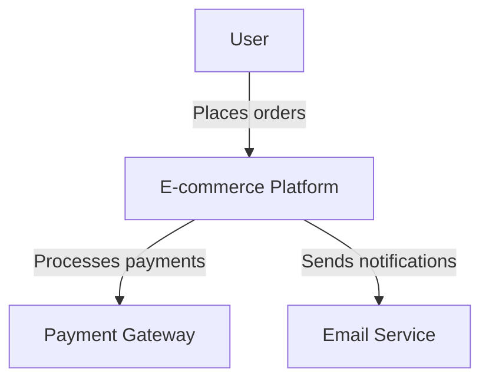

#### Level 2: Container Diagram
Shows major technology choices and how they communicate.

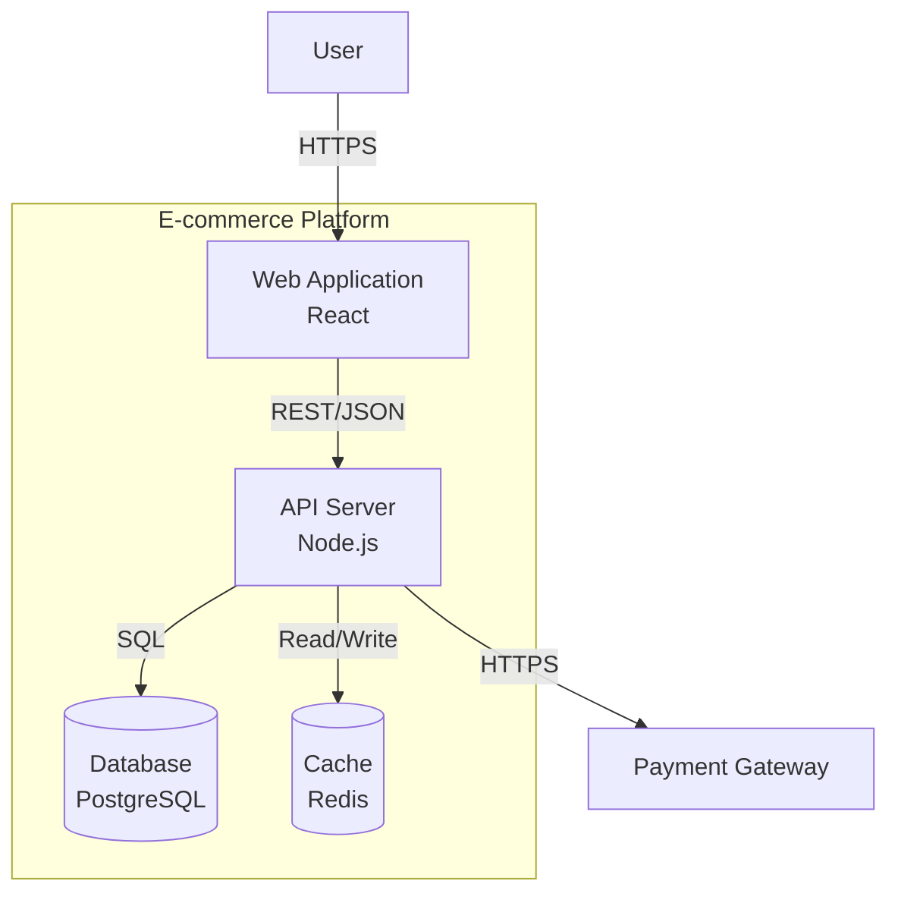

#### Level 3: Component Diagram
Shows components within a container.

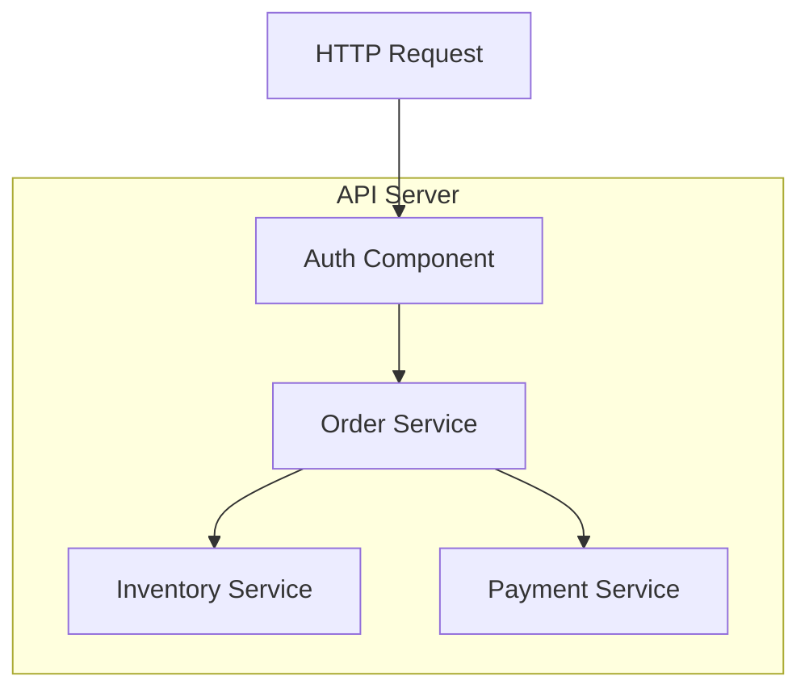

### 2. Sequence Diagrams
Shows interactions over time.

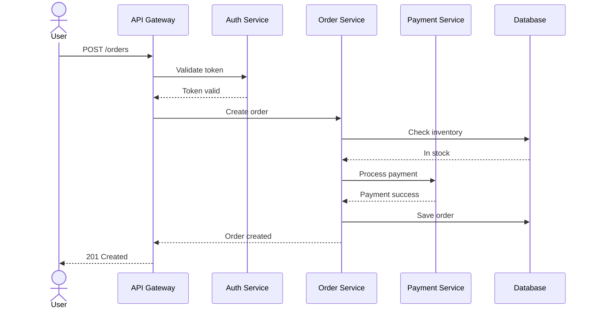

### 3. Data Flow Diagrams
Shows how data moves through the system.

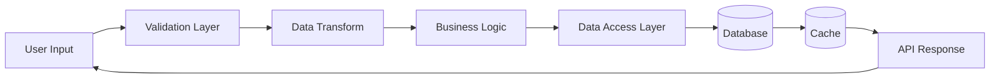

### 4. Component Architecture
Shows relationships between major components.

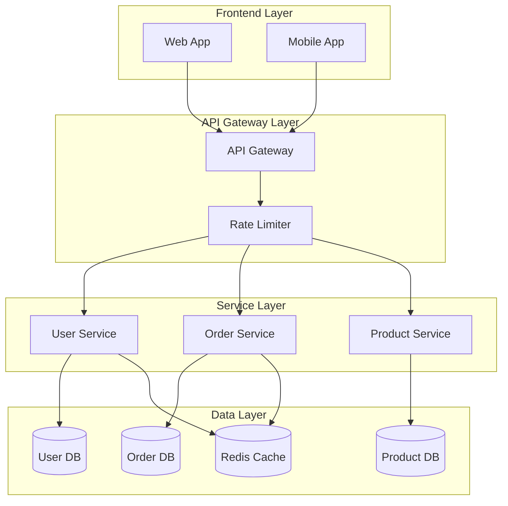

### 5. Deployment Architecture
Shows physical/cloud infrastructure.

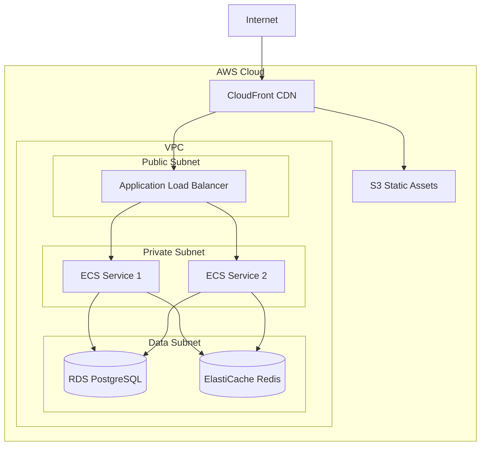

## Example: Order Processing System

### Input Flow Description

```
User submits order through web app:
1. User fills order form → Frontend validates
2. Frontend sends to API Gateway → Gateway checks rate limits
3. Gateway routes to Auth Service → Validates JWT token
4. Auth approves → Gateway forwards to Order Service
5. Order Service checks inventory → Queries Inventory DB
6. If available → Order Service calls Payment Service
7. Payment Service → Calls external Payment Provider (Stripe)
8. Payment succeeds → Order Service saves to Order DB
9. Order Service publishes event → Event bus (Kafka)
10. Notification Service consumes event → Sends email via SendGrid
11. Response propagates back → User receives confirmation
```

### Output: Complete Diagram Set

#### 1. Context Diagram (Highest Level)

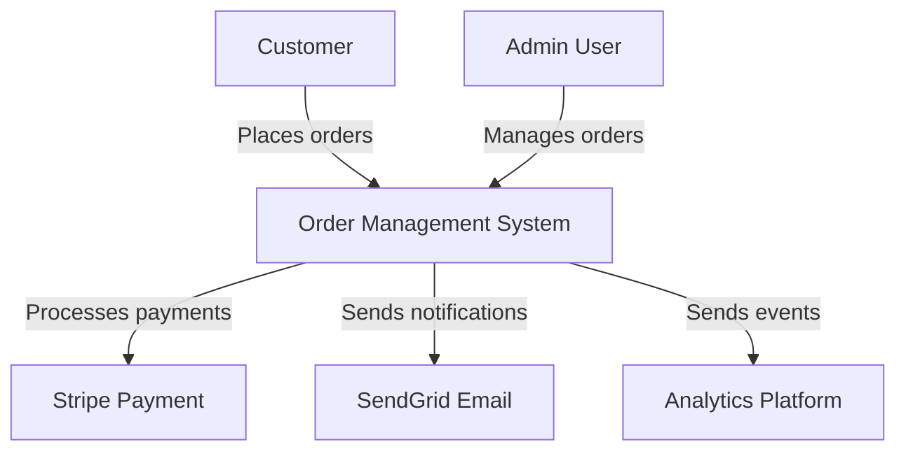

#### 2. Container Diagram (Technology Stack)

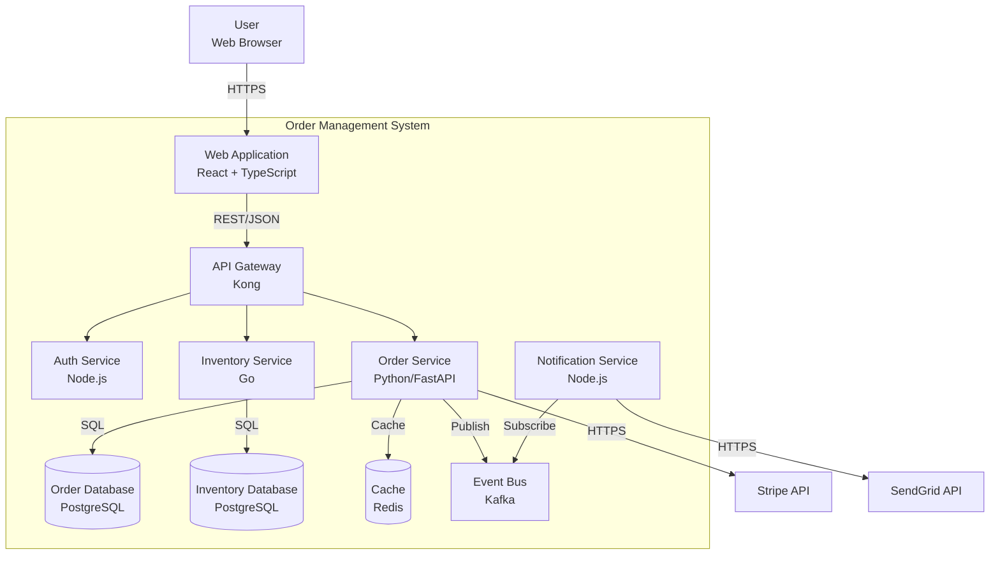

#### 3. Sequence Diagram (Order Flow)

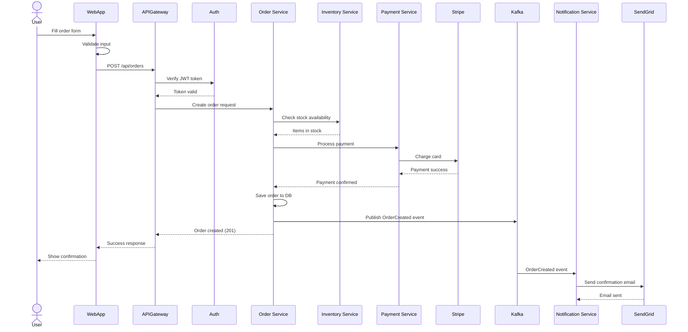

#### 4. Component Diagram (Order Service Internals)

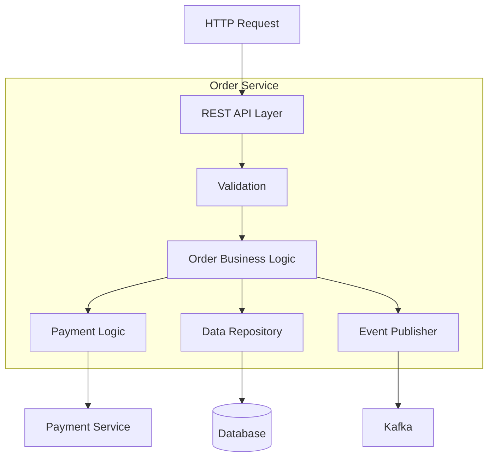

## Best Practices

### Use Clear Labels

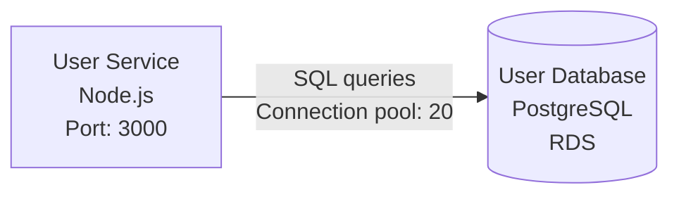

### Show Technology Stack

Include:
- Programming language
- Framework
- Database type
- Communication protocol
- Key configuration

### Indicate Data Flow Direction

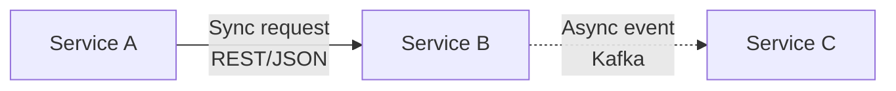

Use:
- Solid arrows `-->` for synchronous calls
- Dotted arrows `-.->` for asynchronous/events
- Bidirectional `<-->` when both services call each other

### Group Related Components

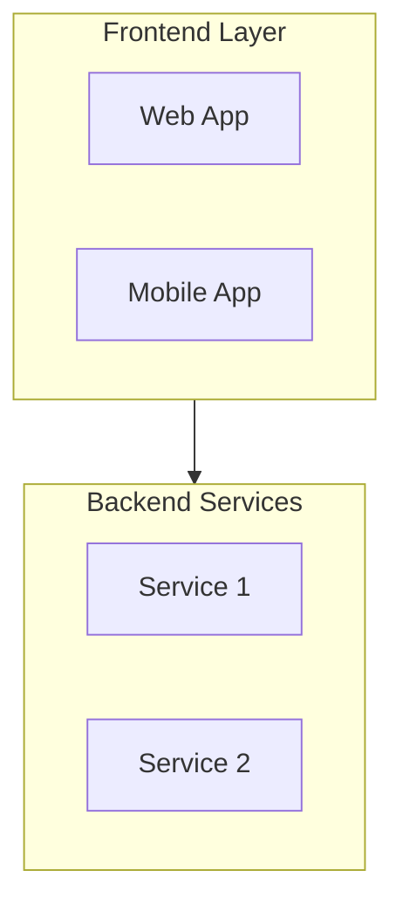

### Show Failure Paths

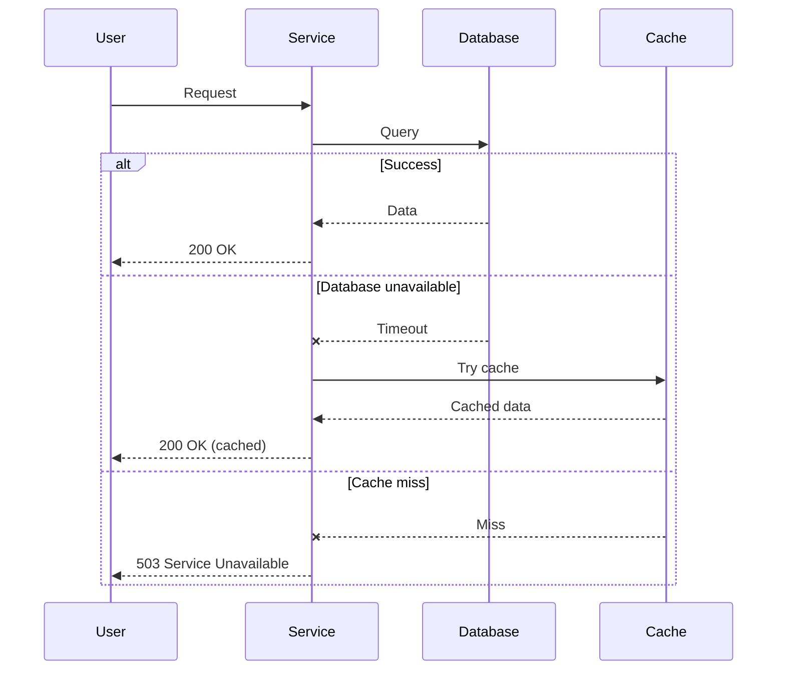

## Diagram Selection Guide

| Scenario | Best Diagram Type |
|----------|------------------|
| System overview for executives | Context (C4 Level 1) |
| Technology decisions | Container (C4 Level 2) |
| Internal service design | Component (C4 Level 3) |
| API request/response flow | Sequence diagram |
| Event-driven architecture | Sequence + data flow |
| Data transformation | Data flow diagram |
| Infrastructure setup | Deployment diagram |
| Database schema | Entity relationship diagram |
| Authentication flow | Sequence diagram |
| Error handling | Sequence with alt/opt blocks |

## Tools

### Mermaid (Recommended)
- Text-based, version control friendly
- Renders in Markdown, GitHub, GitLab
- Good for simple to moderate diagrams
- Syntax: [Mermaid Documentation](https://mermaid.js.org/)

### PlantUML
- More powerful than Mermaid
- Better for complex diagrams
- Requires Java runtime
- Syntax: [PlantUML Documentation](https://plantuml.com/)

### Draw.io (Diagrams.net)
- Visual editor (drag and drop)
- Export as PNG, SVG, XML
- Good for presentations
- Tool: [Draw.io](https://app.diagrams.net/)

### Lucidchart
- Professional diagramming tool
- Team collaboration features
- Good for formal documentation
- Tool: [Lucidchart](https://www.lucidchart.com/)

## Resources

### Architecture Patterns
- [C4 Model](https://c4model.com/) - Standard for architecture diagrams
- [AWS Architecture Icons](https://aws.amazon.com/architecture/icons/) - Cloud diagrams
- [Azure Architecture Icons](https://learn.microsoft.com/en-us/azure/architecture/icons/)

### Diagram Best Practices
- [Simon Brown on Visualizing Software Architecture](https://www.youtube.com/watch?v=x2-rSnhpw0g)
- [Architecture Diagrams as Code](https://www.thoughtworks.com/insights/articles/architecture-diagrams-as-code)

### Learning Resources
- [Mermaid Live Editor](https://mermaid.live/) - Try diagrams online
- [PlantUML Examples](https://real-world-plantuml.com/) - Real-world examples

## Tips

1. **Start simple**: Begin with context, add detail progressively
2. **Consistent notation**: Use same shapes/colors for same concepts
3. **Limit scope**: One diagram = one story
4. **Add legends**: Explain symbols, colors, line styles
5. **Version control**: Store diagrams as code when possible
6. **Keep updated**: Outdated diagrams worse than no diagrams
7. **Audience matters**: Technical depth varies by audience

## Quick Checklist

- [ ] Diagram type appropriate for audience
- [ ] All components labeled clearly
- [ ] Technology stack indicated
- [ ] Communication protocols shown
- [ ] Data flow direction clear
- [ ] Related components grouped
- [ ] Legend provided (if needed)
- [ ] Consistent notation throughout
- [ ] Text readable (not too small)
- [ ] Failure paths shown (if relevant)
