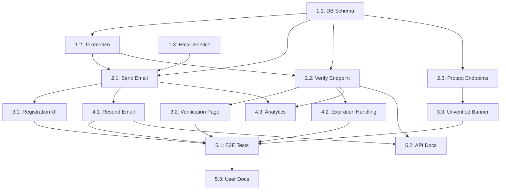

# Thought to Task Decomposition

## Purpose

Break features or changes into concrete, dependency-aware tasks that are estimable and assignable.

## When to Use

- Sprint planning sessions
- Feature kickoff and scoping
- Delegating work to team members
- Breaking down epics into stories
- Creating implementation roadmaps
- Resource allocation planning

## INVEST Criteria

Good tasks are:

- **I**ndependent - Can be worked on separately
- **N**egotiable - Details can be discussed
- **V**aluable - Delivers value to users/system
- **E**stimable - Can estimate effort
- **S**mall - Completable in reasonable time
- **T**estable - Clear acceptance criteria

## Task Decomposition Process

### Step 1: Understand the Feature

```markdown
Questions to answer:
- What problem does this solve?
- Who are the users?
- What's the expected outcome?
- What are the constraints?
- What's the deadline/appetite?
```

### Step 2: Identify Major Components

```markdown
Break into layers/areas:
- Backend (API, business logic, database)
- Frontend (UI, state management, routing)
- Infrastructure (deployment, monitoring)
- Testing (unit, integration, E2E)
- Documentation (API docs, user guides)
```

### Step 3: Create Dependency Graph

```markdown
Identify what must happen first:
- Database schema before API implementation
- API before frontend integration
- Core logic before edge case handling
- Setup before features
```

### Step 4: Define Tasks

For each task, specify:
- Clear description
- Acceptance criteria
- Dependencies
- Estimated effort
- Assignee (or skill level needed)

## Example: Email Verification Feature

### Feature Request

```
"Add email verification to user registration. Users should receive an email
with a verification link. They can't use the app until email is verified."
```

### Decomposed Tasks

#### Phase 1: Foundation (Week 1)

```markdown
**Task 1.1: Database Schema**
Description: Add email verification fields to users table
Acceptance Criteria:
  - Add `email_verified` boolean column (default: false)
  - Add `verification_token` string column (nullable)
  - Add `verification_sent_at` timestamp column (nullable)
  - Migration is reversible
Depends on: None
Estimated: 2 hours
Assignee: Backend developer
Test: Migration runs successfully, schema matches design

---

**Task 1.2: Generate Verification Token**
Description: Create function to generate secure verification tokens
Acceptance Criteria:
  - Token is cryptographically secure (use UUID or crypto.randomBytes)
  - Token is unique
  - Function is unit tested
Depends on: Task 1.1
Estimated: 3 hours
Assignee: Backend developer
Test: Unit tests verify token uniqueness and security

---

**Task 1.3: Email Service Integration**
Description: Set up email sending service (SendGrid/Mailgun)
Acceptance Criteria:
  - Service credentials configured via environment variables
  - Wrapper function for sending emails
  - HTML email template created
  - Error handling for failed sends
  - Retry logic implemented
Depends on: None (can work in parallel)
Estimated: 4 hours
Assignee: Backend developer
Test: Can send test email successfully
```

#### Phase 2: Core Logic (Week 1-2)

```markdown
**Task 2.1: Send Verification Email on Registration**
Description: Modify registration endpoint to send verification email
Acceptance Criteria:
  - On user registration, generate token
  - Save token to database
  - Send email with verification link
  - Email sending is asynchronous (doesn't block response)
  - Log email sending attempts
Depends on: Task 1.1, 1.2, 1.3
Estimated: 4 hours
Assignee: Backend developer
Test: Integration test verifies email sent, token saved

---

**Task 2.2: Create Email Verification Endpoint**
Description: Add GET /api/verify-email?token=xxx endpoint
Acceptance Criteria:
  - Accepts token as query parameter
  - Validates token exists and is not expired (24h TTL)
  - Marks user as verified
  - Returns success/error response
  - Handles invalid/expired tokens gracefully
Depends on: Task 1.1, 1.2
Estimated: 4 hours
Assignee: Backend developer
Test: Integration tests for valid, invalid, expired tokens

---

**Task 2.3: Protect Endpoints with Verification Check**
Description: Add middleware to require email verification
Acceptance Criteria:
  - Middleware checks if user's email is verified
  - Returns 403 Forbidden if not verified
  - Applied to protected endpoints (not login/register)
  - Clear error message returned
Depends on: Task 1.1
Estimated: 3 hours
Assignee: Backend developer
Test: Unverified users blocked, verified users allowed
```

#### Phase 3: Frontend (Week 2)

```markdown
**Task 3.1: Registration Flow Update**
Description: Update registration UI to show verification notice
Acceptance Criteria:
  - After registration, show "Check your email" message
  - Display user's email address
  - Add "Resend verification email" button
  - Handle email sending errors
Depends on: Task 2.1
Estimated: 4 hours
Assignee: Frontend developer
Test: Manual testing of registration flow

---

**Task 3.2: Email Verification Landing Page**
Description: Create page for /verify-email?token=xxx route
Acceptance Criteria:
  - Shows loading state while verifying
  - Shows success message on verification
  - Shows error message if token invalid/expired
  - "Continue to app" button on success
  - "Resend verification email" on failure
Depends on: Task 2.2
Estimated: 5 hours
Assignee: Frontend developer
Test: Manual testing with valid/invalid tokens

---

**Task 3.3: Handle Unverified State**
Description: Show banner for unverified users
Acceptance Criteria:
  - Banner appears on all pages if email not verified
  - Shows "Please verify your email" message
  - "Resend email" button in banner
  - Banner dismissible (shows again on reload)
Depends on: Task 2.3
Estimated: 3 hours
Assignee: Frontend developer
Test: Banner shows for unverified, hidden for verified
```

#### Phase 4: Edge Cases & Polish (Week 2)

```markdown
**Task 4.1: Resend Verification Email**
Description: Add endpoint to resend verification email
Acceptance Criteria:
  - POST /api/resend-verification endpoint
  - Rate limited (max 3 per hour per user)
  - Generates new token (invalidates old)
  - Returns 429 if rate limit exceeded
Depends on: Task 2.1
Estimated: 3 hours
Assignee: Backend developer
Test: Rate limiting works, new token invalidates old

---

**Task 4.2: Token Expiration Handling**
Description: Handle expired tokens gracefully
Acceptance Criteria:
  - Tokens expire after 24 hours
  - Clear error message for expired tokens
  - "Request new verification email" option shown
Depends on: Task 2.2
Estimated: 2 hours
Assignee: Backend developer
Test: Expired token rejected, clear error message

---

**Task 4.3: Email Verification Analytics**
Description: Add metrics for email verification flow
Acceptance Criteria:
  - Track: emails sent, verification success rate, time to verify
  - Metrics sent to monitoring system
  - Dashboard showing verification funnel
Depends on: Task 2.1, 2.2
Estimated: 3 hours
Assignee: Backend developer
Test: Metrics appear in dashboard
```

#### Phase 5: Testing & Documentation (Week 2-3)

```markdown
**Task 5.1: End-to-End Tests**
Description: Create E2E tests for verification flow
Acceptance Criteria:
  - Test full registration → verify → login flow
  - Test expired token flow
  - Test resend email flow
  - Tests run in CI/CD
Depends on: All above tasks
Estimated: 5 hours
Assignee: QA or Backend developer
Test: E2E tests pass in CI

---

**Task 5.2: API Documentation**
Description: Document verification endpoints
Acceptance Criteria:
  - OpenAPI spec updated for new endpoints
  - Examples provided
  - Error codes documented
  - Published to API docs site
Depends on: Task 2.2, 4.1
Estimated: 2 hours
Assignee: Backend developer
Test: API docs accurate and complete

---

**Task 5.3: User Documentation**
Description: Create help article for email verification
Acceptance Criteria:
  - What is email verification
  - How to verify email
  - Troubleshooting (didn't receive email, expired link)
  - FAQ section
Depends on: All functional tasks
Estimated: 3 hours
Assignee: Technical writer or PM
Test: User docs reviewed and published
```

### Task Summary

```markdown
Total Estimated: 50 hours (approximately 1.5 weeks for 2 developers)

By Phase:
- Phase 1 (Foundation): 9 hours
- Phase 2 (Core Logic): 11 hours
- Phase 3 (Frontend): 12 hours
- Phase 4 (Edge Cases): 8 hours
- Phase 5 (Testing & Docs): 10 hours

By Role:
- Backend Developer: 31 hours
- Frontend Developer: 12 hours
- QA/Testing: 5 hours
- Technical Writer: 3 hours

Critical Path:
Task 1.1 → Task 1.2 → Task 2.1 → Task 3.1 (Registration flow)
Task 1.1 → Task 2.2 → Task 3.2 (Verification page)
```

### Dependency Diagram



## Task Decomposition Patterns

### Pattern 1: By Layer

```markdown
1. Database/Model layer
2. Business logic layer
3. API layer
4. Frontend layer
5. Testing layer
```

### Pattern 2: By User Story

```markdown
1. As a user, I can register with email
2. As a user, I receive verification email
3. As a user, I can verify my email
4. As a user, I am blocked until verified
5. As a user, I can resend verification
```

### Pattern 3: By Risk

```markdown
1. High-risk items first (derisking)
2. Core functionality
3. Edge cases
4. Polish and UX improvements
```

### Pattern 4: By Value

```markdown
1. MVP (minimum viable)
2. Important features
3. Nice-to-have features
4. Future enhancements
```

## Delegation Guidelines

### Task Sizing for Skill Levels

```markdown
**Junior Developer** (< 1 year):
- Size: 2-4 hours
- Type: Well-defined, low ambiguity
- Examples:
  - Add validation to existing form
  - Write unit tests for specific function
  - Update documentation
  - Fix typo or formatting

**Mid-Level Developer** (1-3 years):
- Size: 4-8 hours (half day to full day)
- Type: Moderate complexity, some ambiguity
- Examples:
  - Create new API endpoint
  - Implement feature with clear requirements
  - Refactor module with guidance
  - Debug and fix known issue

**Senior Developer** (3+ years):
- Size: 1-3 days
- Type: High complexity, requires design decisions
- Examples:
  - Design and implement new subsystem
  - Complex refactoring
  - Performance optimization
  - Technical spike/investigation
```

### Task Assignment Matrix

| Task Type | Junior | Mid | Senior |
|-----------|--------|-----|--------|
| Database schema design | ❌ | ⚠️ With review | ✅ |
| Simple CRUD endpoint | ✅ | ✅ | ✅ |
| Complex business logic | ❌ | ⚠️ With pairing | ✅ |
| Frontend component | ✅ If clear design | ✅ | ✅ |
| Integration with external API | ❌ | ✅ | ✅ |
| Performance optimization | ❌ | ⚠️ | ✅ |
| Security implementation | ❌ | ❌ | ✅ |
| Writing tests | ✅ | ✅ | ✅ |
| Documentation | ✅ | ✅ | ✅ |
| Technical design | ❌ | ⚠️ | ✅ |

## Task Template

```markdown
## [Task ID]: [Clear, Action-Oriented Title]

### Description
[What needs to be done and why]

### Acceptance Criteria
- [ ] Criterion 1 (specific, testable)
- [ ] Criterion 2
- [ ] Criterion 3

### Dependencies
- Depends on: [Task ID, Task ID]
- Blocked by: [External factor, if any]

### Technical Notes
[Implementation hints, gotchas, decisions needed]

### Estimated Effort
[Hours or T-shirt size: S/M/L/XL]

### Assignee
[Name or skill level: Junior/Mid/Senior]

### Testing Strategy
[How to verify this works]

### Definition of Done
- [ ] Code written and reviewed
- [ ] Tests added/updated
- [ ] Documentation updated
- [ ] Deployed to staging
- [ ] QA approved
```

## Common Mistakes

### 1. Tasks Too Large

❌ **Bad**: "Implement user authentication" (too vague, too big)
✅ **Good**:
- Create user login endpoint
- Add JWT token generation
- Implement token validation middleware
- Add password reset flow

### 2. Missing Dependencies

❌ **Bad**: Starting frontend before API exists
✅ **Good**: Identify that API must be completed first

### 3. No Acceptance Criteria

❌ **Bad**: "Fix the bug"
✅ **Good**: "User can login with email, error message shown for invalid credentials, session persists on page reload"

### 4. Ignoring Risk

❌ **Bad**: Leaving high-risk items to the end
✅ **Good**: Tackle unknowns and risky items early

### 5. Not Considering Skills

❌ **Bad**: Assigning complex security task to junior
✅ **Good**: Matching task complexity to developer skill level

## Resources

### Task Management
- [User Story Mapping](https://www.jpattonassociates.com/user-story-mapping/)
- [INVEST Criteria](https://en.wikipedia.org/wiki/INVEST_(mnemonic))
- [Task Breakdown Tips](https://www.mountaingoatsoftware.com/blog/breaking-down-user-stories)

### Project Planning
- [Shape Up](https://basecamp.com/shapeup) - 6-week cycle planning
- [Agile Estimation Techniques](https://www.atlassian.com/agile/project-management/estimation)

### Tools
- [Jira](https://www.atlassian.com/software/jira) - Task tracking
- [Linear](https://linear.app/) - Modern issue tracking
- [Trello](https://trello.com/) - Simple kanban boards

## Quick Checklist

For each task:
- [ ] Clear, action-oriented title
- [ ] Specific description (what and why)
- [ ] Testable acceptance criteria (2-5 items)
- [ ] Dependencies identified
- [ ] Estimated effort reasonable (< 2 days)
- [ ] Appropriate for assignee skill level
- [ ] Testing approach defined
- [ ] Fits INVEST criteria

For the feature:
- [ ] All tasks identified
- [ ] Dependencies mapped
- [ ] Critical path identified
- [ ] Risks addressed early
- [ ] Work balanced across team
- [ ] Buffer time included
- [ ] MVP defined separately from nice-to-haves
